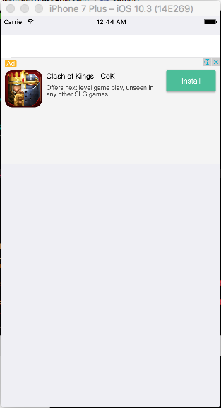

# NativeExpressRow

<p align="left">

<a href="https://travis-ci.org/yurevich1/NativeExpressRow"></a>

<a href="https://cocoapods.org/pods/NativeExpressRow"></a>
<a href="https://raw.githubusercontent.com/yurevich1/NativeExpressRow/master/LICENSE"></a>
</p>

By [Petrukhin Vyacheslav](http://slava.online).

## Contents
 * [Introduction](#introduction)
 * [Usage](#usage)
 * [Requirements](#requirements)
 * [Getting involved](#getting-involved)
 * [Examples](#examples)
 * [Installation](#installation)
 * [Customization](#customization)
 	* [NativeExpressRow parameters](#nativeexpressrow-parameters)

## Introduction

`NativeExpressRow` is a custom row for Eureka designed to work with Native Express Ads for Google AdMob. It simplifies the ads implementation.

* Features
  * Height setup



## Usage

First of all you have to register your iOS application in the [AdMob](https://admob.com) and [Firebase](https://firebase.google.com)
You have to create both `"YOUR_ADMOB_APP_ID"` and `"your-admob-unit-id"`.

 After that, you can use this library.

`AppDelegate.swift`

```swift
import UIKit
import Firebase

@UIApplicationMain
class AppDelegate: UIResponder, UIApplicationDelegate {

    var window: UIWindow?


    func application(_ application: UIApplication, didFinishLaunchingWithOptions launchOptions: [UIApplicationLaunchOptionsKey: Any]?) -> Bool {
        // Override point for customization after application launch.
        FirebaseApp.configure()
        GADMobileAds.configure(withApplicationID: "YOUR_ADMOB_APP_ID")
        return true
    }
}
```

and `FormViewController`

```swift
import NativeExpressRow

class ViewController: FormViewController {

    override func viewDidLoad() {
        super.viewDidLoad()

        form +++ Section()
            <<< NativeExpressRow()  {
                $0.value = "your-admob-unit-id"
                $0.adHeight = 132.0
            }
    }
}
```

## Requirements

* iOS 8.0+
* Xcode 8.3+

## Getting involved

* If you **want to contribute** please feel free to **submit pull requests**.
* If you **have a feature request** or you **found a bug** please **open an issue**.

Before contribute check the [CONTRIBUTING](CONTRIBUTING.md) file for more info.

## Examples

Follow these steps to run Example project:
 * First of all you have to register your iOS application in the [AdMob](https://admob.com) and [Firebase](https://firebase.google.com)
 * You have to create both `"YOUR_ADMOB_APP_ID"` and `"your-admob-unit-id"`.
 * Clone NativeExpressRow repository
 * Open terminal in the downloaded folder and run bin/setup script
 * Open NativeExpressRow workspace
 * Run the *Example* project.

## Installation

#### CocoaPods

[CocoaPods](https://cocoapods.org/) is a dependency manager for Cocoa projects.

To install NativeExpressRow, simply add the following line to your Podfile:

```ruby
pod 'NativeExpressRow', '~> 1.0'
```

#### Carthage

[Carthage](https://github.com/Carthage/Carthage) is a simple, decentralized dependency manager for Cocoa.

To install NativeExpressRow, simply add the following line to your Cartfile:

```ogdl
github "EurekaCommunity/NativeExpressRow" ~> 1.0
```


## Customization

For basic styling like colors, margins, separators you should use `cellSetup` and `cellUpdate`.

### NativeExpressRow parameters

* `var value: String  = "your-admob-unit-id"`: Stores your admob unit id
* `var adHeight: Double`: sets your banner height.

For instance,

you can do this in any `FormViewController` class:

```swift
<<< NativeExpressRow() {
                $0.value = "your-admob-unit-id"
                $0.adHeight = 132.0
            }
```


## Author

* [Petrukhin Vyacheslav](http://slava.online)

